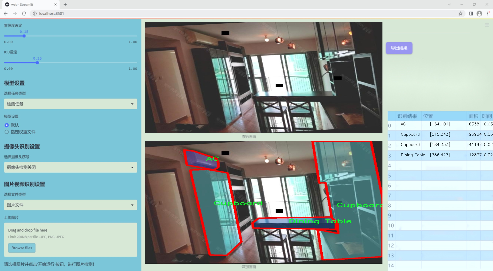

# 改进yolo11-HWD等200+全套创新点大全：室内场景图像分割系统源码＆数据集全套

### 1.图片效果展示




##### 项目来源 **[人工智能促进会 2024.10.22](https://kdocs.cn/l/cszuIiCKVNis)**

##### 注意：由于项目一直在更新迭代，上面“1.图片效果展示”和“2.视频效果展示”展示的系统图片或者视频可能为老版本，新版本在老版本的基础上升级如下：（实际效果以升级的新版本为准）

  （1）适配了YOLOV11的“目标检测”模型和“实例分割”模型，通过加载相应的权重（.pt）文件即可自适应加载模型。

  （2）支持“图片识别”、“视频识别”、“摄像头实时识别”三种识别模式。

  （3）支持“图片识别”、“视频识别”、“摄像头实时识别”三种识别结果保存导出，解决手动导出（容易卡顿出现爆内存）存在的问题，识别完自动保存结果并导出到tempDir中。

  （4）支持Web前端系统中的标题、背景图等自定义修改。

  另外本项目提供训练的数据集和训练教程,暂不提供权重文件（best.pt）,需要您按照教程进行训练后实现图片演示和Web前端界面演示的效果。

### 2.视频效果展示

[2.1 视频效果展示](https://www.bilibili.com/video/BV1GqydYwEEh/)

### 3.背景

研究背景与意义

随着智能家居和物联网技术的迅速发展，室内场景的智能识别与分析已成为计算机视觉领域的重要研究方向。室内环境的复杂性和多样性使得图像分割技术在实际应用中面临诸多挑战。尤其是在家具、家电等物体的识别与分割上，传统的图像处理方法往往难以满足实时性和准确性的要求。因此，基于深度学习的图像分割技术逐渐成为研究热点，其中YOLO（You Only Look Once）系列模型因其高效的实时检测能力而受到广泛关注。

本研究旨在基于改进的YOLOv11模型，构建一个高效的室内场景图像分割系统。我们将利用包含2600张图像的多样化数据集，涵盖了如沙发、床、冰箱、洗衣机等20个类别的室内物体。这些类别不仅具有较高的实用价值，也在日常生活中具有广泛的应用场景。通过对这些图像进行深入分析和处理，能够有效提升室内物体的识别率和分割精度，从而为智能家居系统的实现提供技术支持。

此外，改进YOLOv11模型的引入，旨在通过优化网络结构和训练策略，提升模型在复杂室内环境下的表现。研究将探讨如何在保持实时性和准确性的前提下，进一步提高模型对不同光照、角度和遮挡条件下的鲁棒性。这不仅为室内场景的自动化识别提供了新的思路，也为相关领域如机器人导航、智能监控等应用奠定了基础。

综上所述，本研究不仅具有重要的理论意义，也在实际应用中展现出广阔的前景。通过对室内场景图像分割技术的深入探索，我们期望能够推动智能家居和相关技术的发展，为人们的生活带来更多便利与创新。

### 4.数据集信息展示

##### 4.1 本项目数据集详细数据（类别数＆类别名）

nc: 27
names: ['AC', 'Bathtub', 'Bed Frame', 'Bed', 'Closet', 'Cupboard', 'Desk', 'Dining Table', 'Dish Washer', 'Door', 'Exhaust Fan', 'Exhaust Hood', 'Faucet', 'Fridge', 'Microwave', 'Oven', 'Sink', 'Sofa', 'Stove', 'TV', 'Thermo Ventilator', 'Toilet Sink', 'Toilet', 'Washing Machine', 'Water Cubicle', 'Water Heater', 'Windowsill']


该项目为【图像分割】数据集，请在【训练教程和Web端加载模型教程（第三步）】这一步的时候按照【图像分割】部分的教程来训练

##### 4.2 本项目数据集信息介绍

本项目数据集信息介绍

本项目所使用的数据集名为“all_finalize”，其主要目的是为改进YOLOv11的室内场景图像分割系统提供高质量的训练数据。该数据集包含27个类别，涵盖了各种常见的室内物品和设施，旨在增强模型对室内环境的理解和识别能力。具体类别包括：空调（AC）、浴缸（Bathtub）、床架（Bed Frame）、床（Bed）、衣柜（Closet）、橱柜（Cupboard）、书桌（Desk）、餐桌（Dining Table）、洗碗机（Dish Washer）、门（Door）、排气扇（Exhaust Fan）、抽油烟机（Exhaust Hood）、水龙头（Faucet）、冰箱（Fridge）、微波炉（Microwave）、烤箱（Oven）、水槽（Sink）、沙发（Sofa）、炉灶（Stove）、电视（TV）、热风机（Thermo Ventilator）、洗手池（Toilet Sink）、厕所（Toilet）、洗衣机（Washing Machine）、水斗（Water Cubicle）、热水器（Water Heater）以及窗台（Windowsill）。

该数据集的构建过程注重多样性和代表性，确保所收集的图像涵盖不同的室内环境和布局，以便模型能够在各种场景中进行有效的学习和泛化。每个类别的图像均经过精心标注，确保分割的准确性和一致性，这对于提升YOLOv11在室内场景分割任务中的表现至关重要。通过使用“all_finalize”数据集，研究人员希望能够训练出一个更为精确和高效的图像分割系统，从而在实际应用中实现更好的性能表现。

总之，“all_finalize”数据集不仅为本项目提供了丰富的训练素材，也为未来的研究和应用奠定了坚实的基础，推动室内场景理解技术的进一步发展。


### 5.全套项目环境部署视频教程（零基础手把手教学）

[5.1 所需软件PyCharm和Anaconda安装教程（第一步）](https://www.bilibili.com/video/BV1BoC1YCEKi/?spm_id_from=333.999.0.0&vd_source=bc9aec86d164b67a7004b996143742dc)


[5.2 安装Python虚拟环境创建和依赖库安装视频教程（第二步）](https://www.bilibili.com/video/BV1ZoC1YCEBw?spm_id_from=333.788.videopod.sections&vd_source=bc9aec86d164b67a7004b996143742dc)

### 6.改进YOLOv11训练教程和Web_UI前端加载模型教程（零基础手把手教学）

[6.1 改进YOLOv11训练教程和Web_UI前端加载模型教程（第三步）](https://www.bilibili.com/video/BV1BoC1YCEhR?spm_id_from=333.788.videopod.sections&vd_source=bc9aec86d164b67a7004b996143742dc)


按照上面的训练视频教程链接加载项目提供的数据集，运行train.py即可开始训练



     Epoch   gpu_mem       box       obj       cls    labels  img_size
     1/200     20.8G   0.01576   0.01955  0.007536        22      1280: 100%|██████████| 849/849 [14:42<00:00,  1.04s/it]
               Class     Images     Labels          P          R     mAP@.5 mAP@.5:.95: 100%|██████████| 213/213 [01:14<00:00,  2.87it/s]
                 all       3395      17314      0.994      0.957      0.0957      0.0843

     Epoch   gpu_mem       box       obj       cls    labels  img_size
     2/200     20.8G   0.01578   0.01923  0.007006        22      1280: 100%|██████████| 849/849 [14:44<00:00,  1.04s/it]
               Class     Images     Labels          P          R     mAP@.5 mAP@.5:.95: 100%|██████████| 213/213 [01:12<00:00,  2.95it/s]
                 all       3395      17314      0.996      0.956      0.0957      0.0845

     Epoch   gpu_mem       box       obj       cls    labels  img_size
     3/200     20.8G   0.01561    0.0191  0.006895        27      1280: 100%|██████████| 849/849 [10:56<00:00,  1.29it/s]
               Class     Images     Labels          P          R     mAP@.5 mAP@.5:.95: 100%|███████   | 187/213 [00:52<00:00,  4.04it/s]
                 all       3395      17314      0.996      0.957      0.0957      0.0845


###### [项目数据集下载链接](https://kdocs.cn/l/cszuIiCKVNis)

### 7.原始YOLOv11算法讲解

##### YOLO11简介

> YOLO11源码地址：https://github.com/ultralytics/ultralytics

Ultralytics
YOLO11是一款尖端的、最先进的模型，它在之前YOLO版本成功的基础上进行了构建，并引入了新功能和改进，以进一步提升性能和灵活性。YOLO11设计快速、准确且易于使用，使其成为各种物体检测和跟踪、实例分割、图像分类以及姿态估计任务的绝佳选择。  


**YOLO11创新点如下:**

YOLO 11主要改进包括：  
`增强的特征提取`：YOLO 11采用了改进的骨干和颈部架构，增强了特征提取功能，以实现更精确的目标检测。  
`优化的效率和速度`：优化的架构设计和优化的训练管道提供更快的处理速度，同时保持准确性和性能之间的平衡。  
`更高的精度，更少的参数`：YOLO11m在COCO数据集上实现了更高的平均精度（mAP），参数比YOLOv8m少22%，使其在不影响精度的情况下提高了计算效率。  
`跨环境的适应性`：YOLO 11可以部署在各种环境中，包括边缘设备、云平台和支持NVIDIA GPU的系统。  
`广泛的支持任务`：YOLO 11支持各种计算机视觉任务，如对象检测、实例分割、图像分类、姿态估计和面向对象检测（OBB）。

**YOLO11不同模型尺寸信息：**

YOLO11 提供5种不同的型号规模模型，以满足不同的应用需求：

Model| size (pixels)| mAPval 50-95| Speed CPU ONNX (ms)| Speed T4 TensorRT10
(ms)| params (M)| FLOPs (B)  
---|---|---|---|---|---|---  
YOLO11n| 640| 39.5| 56.1 ± 0.8| 1.5 ± 0.0| 2.6| 6.5  
YOLO11s| 640| 47.0| 90.0 ± 1.2| 2.5 ± 0.0| 9.4| 21.5  
YOLO11m| 640| 51.5| 183.2 ± 2.0| 4.7 ± 0.1| 20.1| 68.0  
YOLO11l| 640| 53.4| 238.6 ± 1.4| 6.2 ± 0.1| 25.3| 86.9  
YOLO11x| 640| 54.7| 462.8 ± 6.7| 11.3 ± 0.2| 56.9| 194.9  
  
**模型常用训练超参数参数说明：**  
`YOLOv11
模型的训练设置包括训练过程中使用的各种超参数和配置`。这些设置会影响模型的性能、速度和准确性。关键的训练设置包括批量大小、学习率、动量和权重衰减。此外，优化器、损失函数和训练数据集组成的选择也会影响训练过程。对这些设置进行仔细的调整和实验对于优化性能至关重要。  
**以下是一些常用的模型训练参数和说明：**

参数名| 默认值| 说明  
---|---|---  
`model`| `None`| 指定用于训练的模型文件。接受指向 `.pt` 预训练模型或 `.yaml`
配置文件。对于定义模型结构或初始化权重至关重要。  
`data`| `None`| 数据集配置文件的路径（例如
`coco8.yaml`).该文件包含特定于数据集的参数，包括训练数据和验证数据的路径、类名和类数。  
`epochs`| `100`| 训练总轮数。每个epoch代表对整个数据集进行一次完整的训练。调整该值会影响训练时间和模型性能。  
`patience`| `100`| 在验证指标没有改善的情况下，提前停止训练所需的epoch数。当性能趋于平稳时停止训练，有助于防止过度拟合。  
`batch`| `16`| 批量大小，有三种模式:设置为整数(例如，’ Batch =16 ‘)， 60% GPU内存利用率的自动模式(’ Batch
=-1 ‘)，或指定利用率分数的自动模式(’ Batch =0.70 ')。  
`imgsz`| `640`| 用于训练的目标图像尺寸。所有图像在输入模型前都会被调整到这一尺寸。影响模型精度和计算复杂度。  
`device`| `None`| 指定用于训练的计算设备：单个 GPU (`device=0`）、多个 GPU (`device=0,1`)、CPU
(`device=cpu`)，或苹果芯片的 MPS (`device=mps`).  
`workers`| `8`| 加载数据的工作线程数（每 `RANK` 多 GPU 训练）。影响数据预处理和输入模型的速度，尤其适用于多 GPU 设置。  
`name`| `None`| 训练运行的名称。用于在项目文件夹内创建一个子目录，用于存储训练日志和输出结果。  
`pretrained`| `True`| 决定是否从预处理模型开始训练。可以是布尔值，也可以是加载权重的特定模型的字符串路径。提高训练效率和模型性能。  
`optimizer`| `'auto'`| 为训练模型选择优化器。选项包括 `SGD`, `Adam`, `AdamW`, `NAdam`,
`RAdam`, `RMSProp` 等，或 `auto` 用于根据模型配置进行自动选择。影响收敛速度和稳定性  
`lr0`| `0.01`| 初始学习率（即 `SGD=1E-2`, `Adam=1E-3`) .调整这个值对优化过程至关重要，会影响模型权重的更新速度。  
`lrf`| `0.01`| 最终学习率占初始学习率的百分比 = (`lr0 * lrf`)，与调度程序结合使用，随着时间的推移调整学习率。  


**各损失函数作用说明：**  
`定位损失box_loss`：预测框与标定框之间的误差（GIoU），越小定位得越准；  
`分类损失cls_loss`：计算锚框与对应的标定分类是否正确，越小分类得越准；  
`动态特征损失（dfl_loss）`：DFLLoss是一种用于回归预测框与目标框之间距离的损失函数。在计算损失时，目标框需要缩放到特征图尺度，即除以相应的stride，并与预测的边界框计算Ciou
Loss，同时与预测的anchors中心点到各边的距离计算回归DFLLoss。  


### 8.200+种全套改进YOLOV11创新点原理讲解

#### 8.1 200+种全套改进YOLOV11创新点原理讲解大全

由于篇幅限制，每个创新点的具体原理讲解就不全部展开，具体见下列网址中的改进模块对应项目的技术原理博客网址【Blog】（创新点均为模块化搭建，原理适配YOLOv5~YOLOv11等各种版本）

[改进模块技术原理博客【Blog】网址链接](https://gitee.com/qunmasj/good)


#### 8.2 精选部分改进YOLOV11创新点原理讲解

###### 这里节选部分改进创新点展开原理讲解(完整的改进原理见上图和[改进模块技术原理博客链接](https://gitee.com/qunmasj/good)【如果此小节的图加载失败可以通过CSDN或者Github搜索该博客的标题访问原始博客，原始博客图片显示正常】


借鉴了其他算法的这些设计思想

借鉴了VGG的思想，使用了较多的3×3卷积，在每一次池化操作后，将通道数翻倍；

借鉴了network in network的思想，使用全局平均池化（global average pooling）做预测，并把1×1的卷积核置于3×3的卷积核之间，用来压缩特征；（我没找到这一步体现在哪里）

使用了批归一化层稳定模型训练，加速收敛，并且起到正则化作用。

    以上三点为Darknet19借鉴其他模型的点。Darknet53当然是在继承了Darknet19的这些优点的基础上再新增了下面这些优点的。因此列在了这里

借鉴了ResNet的思想，在网络中大量使用了残差连接，因此网络结构可以设计的很深，并且缓解了训练中梯度消失的问题，使得模型更容易收敛。

使用步长为2的卷积层代替池化层实现降采样。（这一点在经典的Darknet-53上是很明显的，output的长和宽从256降到128，再降低到64，一路降低到8，应该是通过步长为2的卷积层实现的；在YOLOv11的卷积层中也有体现，比如图中我标出的这些位置）

#### 特征融合

模型架构图如下

  Darknet-53的特点可以这样概括：（Conv卷积模块+Residual Block残差块）串行叠加4次

  Conv卷积层+Residual Block残差网络就被称为一个stage


上面红色指出的那个，原始的Darknet-53里面有一层 卷积，在YOLOv11里面，把一层卷积移除了

为什么移除呢？

        原始Darknet-53模型中间加的这个卷积层做了什么？滤波器（卷积核）的个数从 上一个卷积层的512个，先增加到1024个卷积核，然后下一层卷积的卷积核的个数又降低到512个

        移除掉这一层以后，少了1024个卷积核，就可以少做1024次卷积运算，同时也少了1024个3×3的卷积核的参数，也就是少了9×1024个参数需要拟合。这样可以大大减少了模型的参数，（相当于做了轻量化吧）

        移除掉这个卷积层，可能是因为作者发现移除掉这个卷积层以后，模型的score有所提升，所以才移除掉的。为什么移除掉以后，分数有所提高呢？可能是因为多了这些参数就容易，参数过多导致模型在训练集删过拟合，但是在测试集上表现很差，最终模型的分数比较低。你移除掉这个卷积层以后，参数减少了，过拟合现象不那么严重了，泛化能力增强了。当然这个是，拿着你做实验的结论，反过来再找补，再去强行解释这种现象的合理性。

过拟合


通过MMdetection官方绘制册这个图我们可以看到，进来的这张图片经过一个“Feature Pyramid Network(简称FPN)”，然后最后的P3、P4、P5传递给下一层的Neck和Head去做识别任务。 PAN（Path Aggregation Network）


“FPN是自顶向下，将高层的强语义特征传递下来。PAN就是在FPN的后面添加一个自底向上的金字塔，对FPN补充，将低层的强定位特征传递上去，

FPN是自顶（小尺寸，卷积次数多得到的结果，语义信息丰富）向下（大尺寸，卷积次数少得到的结果），将高层的强语义特征传递下来，对整个金字塔进行增强，不过只增强了语义信息，对定位信息没有传递。PAN就是针对这一点，在FPN的后面添加一个自底（卷积次数少，大尺寸）向上（卷积次数多，小尺寸，语义信息丰富）的金字塔，对FPN补充，将低层的强定位特征传递上去，又被称之为“双塔战术”。

FPN层自顶向下传达强语义特征，而特征金字塔则自底向上传达强定位特征，两两联手，从不同的主干层对不同的检测层进行参数聚合,这样的操作确实很皮。
#### 自底向上增强

而 PAN（Path Aggregation Network）是对 FPN 的一种改进，它的设计理念是在 FPN 后面添加一个自底向上的金字塔。PAN 引入了路径聚合的方式，通过将浅层特征图（低分辨率但语义信息较弱）和深层特征图（高分辨率但语义信息丰富）进行聚合，并沿着特定的路径传递特征信息，将低层的强定位特征传递上去。这样的操作能够进一步增强多尺度特征的表达能力，使得 PAN 在目标检测任务中表现更加优秀。


### 可重参化EfficientRepBiPAN优化Neck
#### Repvgg-style
Repvgg-style的卷积层包含
卷积+ReLU结构，该结构能够有效地利用硬件资源。

在训练时，Repvgg-style的卷积层包含
卷积、
卷积、identity。（下图左图）


在推理时，通过重参数化（re-parameterization），上述的多分支结构可以转换为单分支的
卷积。（下图右图）


基于上述思想，作者设计了对GPU硬件友好的EfficientRep Backbone和Rep-PAN Neck，将它们用于YOLOv6中。

EfficientRep Backbone的结构图：


Rep-PAN Neck结构图：


#### Multi-path
只使用repvgg-style不能达到很好的精度-速度平衡，对于大模型，作者探索了多路径的网络结构。

参考该博客提出了Bep unit，其结构如下图所示：


CSP（Cross Stage Partial）-style计算量小，且有丰富的梯度融合信息，广泛应用于YOLO系列中，比如YOLOv11、PPYOLOE。

作者将Bep unit与CSP-style结合，设计了一种新的网络结构BepC3，如下图所示：


基于BepC3模块，作者设计了新的CSPBep Backbone和CSPRepPAN Neck，以达到很好的精度-速度平衡。

其他YOLO系列在使用CSP-stype结构时，partial ratio设置为1/2。为了达到更好的性能，在YOLOv6m中partial ratio的值为2/3，在YOLOv6l中partial ratio的值为1/2。

对于YOLOv6m，单纯使用Rep-style结构和使用BepC3结构的对比如下图所示：

#### BIFPN
BiFPN 全称 Bidirectional Feature Pyramid Network 加权双向（自顶向下 + 自低向上）特征金字塔网络。

相比较于PANet，BiFPN在设计上的改变：

总结下图：
图d 蓝色部分为自顶向下的通路，传递的是高层特征的语义信息；红色部分是自底向上的通路，传递的是低层特征的位置信息；紫色部分是上述第二点提到的同一层在输入节点和输入节点间新加的一条边。


我们删除那些只有一条输入边的节点。这么做的思路很简单：如果一个节点只有一条输入边而没有特征融合，那么它对旨在融合不同特征的特征网络的贡献就会很小。删除它对我们的网络影响不大，同时简化了双向网络；如上图d 的 P7右边第一个节点

如果原始输入节点和输出节点处于同一层，我们会在原始输入节点和输出节点之间添加一条额外的边。思路：以在不增加太多成本的情况下融合更多的特性；

与只有一个自顶向下和一个自底向上路径的PANet不同，我们处理每个双向路径(自顶向下和自底而上)路径作为一个特征网络层，并重复同一层多次，以实现更高层次的特征融合。如下图EfficientNet 的网络结构所示，我们对BiFPN是重复使用多次的。而这个使用次数也不是我们认为设定的，而是作为参数一起加入网络的设计当中，使用NAS技术算出来的。


Weighted Feature Fusion 带权特征融合：学习不同输入特征的重要性，对不同输入特征有区分的融合。
设计思路：传统的特征融合往往只是简单的 feature map 叠加/相加 (sum them up)，比如使用concat或者shortcut连接，而不对同时加进来的 feature map 进行区分。然而，不同的输入 feature map 具有不同的分辨率，它们对融合输入 feature map 的贡献也是不同的，因此简单的对他们进行相加或叠加处理并不是最佳的操作。所以这里我们提出了一种简单而高效的加权特融合的机制。
常见的带权特征融合有三种方法，分别是：


​
  这种方法比较简单，直接加一个可学习的权重。但是由于这个权重不受限制，所有可能引起训练的不稳定，所有并不推荐。
Softmax-based fusion: O = ∑ i e w i ∗ I i ϵ + ∑ j e w j O = \sum_{i} \frac{e^{w_i} * I_i}{ \epsilon+\sum_{j}e^{w_j}}O=∑ 

 

​
  使用这种方法可以将范围放缩到 [ 0 , 1 ] [0, 1][0,1] 之间，训练稳定，但是训练很慢，所有也不推荐。
Fast normalized fusion: O = ∑ i w i ∗ I i ϵ + ∑ j w j O = \sum_{i} \frac{w_i * I_i}{ \epsilon+\sum_{j}w_j}O=∑ 


### 9.系统功能展示

图9.1.系统支持检测结果表格显示

  图9.2.系统支持置信度和IOU阈值手动调节

  图9.3.系统支持自定义加载权重文件best.pt(需要你通过步骤5中训练获得)

  图9.4.系统支持摄像头实时识别

  图9.5.系统支持图片识别

  图9.6.系统支持视频识别

  图9.7.系统支持识别结果文件自动保存

  图9.8.系统支持Excel导出检测结果数据


### 10. YOLOv11核心改进源码讲解

#### 10.1 head.py

以下是对代码中最核心部分的提取和详细中文注释。为了保持代码的简洁性，保留了关键的类和方法，并进行了必要的注释。

```python
import torch
import torch.nn as nn
import torch.nn.functional as F
from ..modules import Conv, DFL, make_anchors, dist2bbox

class Detect_DyHead(nn.Module):
    """YOLOv8 检测头，使用动态头进行检测模型。"""
    
    def __init__(self, nc=80, hidc=256, block_num=2, ch=()):
        """初始化检测层。

        Args:
            nc (int): 类别数量。
            hidc (int): 隐藏层通道数。
            block_num (int): 动态头块的数量。
            ch (tuple): 输入通道数。
        """
        super().__init__()
        self.nc = nc  # 类别数量
        self.nl = len(ch)  # 检测层数量
        self.reg_max = 16  # DFL通道数量
        self.no = nc + self.reg_max * 4  # 每个锚点的输出数量
        self.stride = torch.zeros(self.nl)  # 构建时计算的步幅
        self.conv = nn.ModuleList(nn.Sequential(Conv(x, hidc, 1)) for x in ch)  # 卷积层
        self.dyhead = nn.Sequential(*[DyHeadBlock(hidc) for _ in range(block_num)])  # 动态头块
        self.cv2 = nn.ModuleList(
            nn.Sequential(Conv(hidc, 3, 3), nn.Conv2d(3, 4 * self.reg_max, 1)) for _ in ch)  # 输出框的卷积层
        self.cv3 = nn.ModuleList(
            nn.Sequential(Conv(hidc, 3, 3), nn.Conv2d(3, self.nc, 1)) for _ in ch)  # 类别的卷积层
        self.dfl = DFL(self.reg_max) if self.reg_max > 1 else nn.Identity()  # DFL层

    def forward(self, x):
        """连接并返回预测的边界框和类别概率。"""
        for i in range(self.nl):
            x[i] = self.conv[i](x[i])  # 通过卷积层处理输入
        x = self.dyhead(x)  # 通过动态头处理
        shape = x[0].shape  # 获取输出形状
        for i in range(self.nl):
            x[i] = torch.cat((self.cv2[i](x[i]), self.cv3[i](x[i])), 1)  # 连接输出
        x_cat = torch.cat([xi.view(shape[0], self.no, -1) for xi in x], 2)  # 重新排列输出
        box, cls = x_cat.split((self.reg_max * 4, self.nc), 1)  # 分割边界框和类别
        dbox = dist2bbox(self.dfl(box), self.anchors.unsqueeze(0), xywh=True, dim=1) * self.strides  # 解码边界框
        return torch.cat((dbox, cls.sigmoid()), 1)  # 返回边界框和类别概率

class Detect_AFPN_P345(nn.Module):
    """YOLOv8 检测头，使用AFPN进行检测模型。"""
    
    def __init__(self, nc=80, hidc=256, ch=()):
        """初始化检测层。

        Args:
            nc (int): 类别数量。
            hidc (int): 隐藏层通道数。
            ch (tuple): 输入通道数。
        """
        super().__init__()
        self.nc = nc  # 类别数量
        self.nl = len(ch)  # 检测层数量
        self.reg_max = 16  # DFL通道数量
        self.no = nc + self.reg_max * 4  # 每个锚点的输出数量
        self.afpn = AFPN_P345(ch, hidc)  # AFPN层
        self.cv2 = nn.ModuleList(
            nn.Sequential(Conv(hidc, 3, 3), nn.Conv2d(3, 4 * self.reg_max, 1)) for _ in ch)  # 输出框的卷积层
        self.cv3 = nn.ModuleList(
            nn.Sequential(Conv(hidc, 3, 3), nn.Conv2d(3, self.nc, 1)) for _ in ch)  # 类别的卷积层
        self.dfl = DFL(self.reg_max) if self.reg_max > 1 else nn.Identity()  # DFL层

    def forward(self, x):
        """连接并返回预测的边界框和类别概率。"""
        x = self.afpn(x)  # 通过AFPN处理输入
        shape = x[0].shape  # 获取输出形状
        for i in range(self.nl):
            x[i] = torch.cat((self.cv2[i](x[i]), self.cv3[i](x[i])), 1)  # 连接输出
        x_cat = torch.cat([xi.view(shape[0], self.no, -1) for xi in x], 2)  # 重新排列输出
        box, cls = x_cat.split((self.reg_max * 4, self.nc), 1)  # 分割边界框和类别
        dbox = dist2bbox(self.dfl(box), self.anchors.unsqueeze(0), xywh=True, dim=1) * self.strides  # 解码边界框
        return torch.cat((dbox, cls.sigmoid()), 1)  # 返回边界框和类别概率

# 其他类（如 Detect_Efficient, DetectAux, Segment_Efficient 等）可以按照相似的方式进行简化和注释
```

### 代码核心部分分析
1. **Detect_DyHead 类**: 这是 YOLOv8 的检测头，使用动态头进行目标检测。它的构造函数初始化了类别数量、隐藏层通道数、动态头块数量和输入通道数。`forward` 方法处理输入并返回预测的边界框和类别概率。

2. **Detect_AFPN_P345 类**: 这是另一个检测头，使用自适应特征金字塔网络（AFPN）。它的构造函数和 `forward` 方法与 `Detect_DyHead` 类似，但使用了 AFPN 进行特征处理。

3. **其他类**: 其他检测头类（如 `Detect_Efficient`, `DetectAux`, `Segment_Efficient` 等）可以采用类似的结构进行简化和注释，主要关注它们的初始化和前向传播逻辑。

以上是对代码中最核心部分的提取和详细注释，旨在帮助理解 YOLOv8 的检测头实现。

该文件 `head.py` 是一个用于构建 YOLOv8 检测模型的模块，主要包含多个检测头的实现。这些检测头用于处理不同的任务，如目标检测、实例分割、姿态估计等。文件中定义了多个类，每个类实现了特定的检测头功能，以下是对主要部分的逐步解析。

首先，文件导入了一些必要的库和模块，包括 PyTorch 的核心库和一些自定义模块。这些模块提供了构建卷积层、深度可分离卷积、动态头等功能。

接下来，文件定义了多个检测头类，例如 `Detect_DyHead`、`Detect_AFPN_P345`、`Detect_Efficient` 等。每个类都继承自 `nn.Module`，并在其构造函数中初始化了必要的参数和层。

`Detect_DyHead` 类是 YOLOv8 的检测头，使用动态头（DyHead）进行目标检测。它的构造函数接受类别数、隐藏通道数、块数和通道信息。类中定义了多个卷积层和动态头的模块，`forward` 方法负责处理输入数据并返回预测的边界框和类别概率。

`Detect_AFPN_P345` 类实现了一个带有自适应特征金字塔网络（AFPN）的检测头。它通过自适应地整合不同层的特征来提高检测性能。该类的结构与 `Detect_DyHead` 类似，但使用了不同的特征融合策略。

`Detect_Efficient` 类则是一个高效的检测头，设计上更注重计算效率，适合在资源受限的环境中使用。它使用了更少的参数和计算量来实现相似的检测性能。

此外，文件中还定义了一些辅助类，如 `Scale` 和 `Conv_GN`，用于实现可学习的缩放参数和标准卷积层。`Detect_LSCD`、`Detect_LSDECD` 等类则是轻量级的共享卷积检测头，旨在减少模型的参数量和计算量。

文件的最后部分定义了一些特殊的检测头，如 `Detect_TADDH` 和 `Detect_LADH`，这些类实现了任务动态对齐检测头和轻量级共享卷积检测头，分别用于不同的应用场景。

总的来说，`head.py` 文件通过定义多个检测头类，提供了灵活的接口和模块化的设计，使得 YOLOv8 模型能够适应多种检测任务，并在性能和效率之间取得平衡。

#### 10.2 metaformer.py

以下是代码中最核心的部分，并附上详细的中文注释：

```python
import torch
import torch.nn as nn
import torch.nn.functional as F

class MF_Attention(nn.Module):
    """
    自注意力机制（Self-Attention）实现，源自Transformer模型。
    """
    def __init__(self, dim, head_dim=32, num_heads=None, qkv_bias=False,
                 attn_drop=0., proj_drop=0., proj_bias=False):
        super().__init__()

        # 头部维度和缩放因子
        self.head_dim = head_dim
        self.scale = head_dim ** -0.5

        # 计算头的数量
        self.num_heads = num_heads if num_heads else dim // head_dim
        if self.num_heads == 0:
            self.num_heads = 1
        
        # 计算注意力维度
        self.attention_dim = self.num_heads * self.head_dim

        # 定义线性层用于生成Q、K、V
        self.qkv = nn.Linear(dim, self.attention_dim * 3, bias=qkv_bias)
        self.attn_drop = nn.Dropout(attn_drop)  # 注意力的dropout层
        self.proj = nn.Linear(self.attention_dim, dim, bias=proj_bias)  # 投影层
        self.proj_drop = nn.Dropout(proj_drop)  # 投影后的dropout层

    def forward(self, x):
        B, H, W, C = x.shape  # B: batch size, H: height, W: width, C: channels
        N = H * W  # 计算总的token数量
        # 计算Q、K、V
        qkv = self.qkv(x).reshape(B, N, 3, self.num_heads, self.head_dim).permute(2, 0, 3, 1, 4)
        q, k, v = qkv.unbind(0)  # 分离Q、K、V

        # 计算注意力权重
        attn = (q @ k.transpose(-2, -1)) * self.scale  # 点积注意力
        attn = attn.softmax(dim=-1)  # 归一化
        attn = self.attn_drop(attn)  # 应用dropout

        # 计算输出
        x = (attn @ v).transpose(1, 2).reshape(B, H, W, self.attention_dim)  # 计算加权和
        x = self.proj(x)  # 投影回原始维度
        x = self.proj_drop(x)  # 应用dropout
        return x  # 返回结果


class Mlp(nn.Module):
    """ 
    多层感知机（MLP）模块，通常用于MetaFormer模型。
    """
    def __init__(self, dim, mlp_ratio=4, out_features=None, act_layer=nn.ReLU, drop=0., bias=False):
        super().__init__()
        in_features = dim
        out_features = out_features or in_features  # 输出特征维度
        hidden_features = int(mlp_ratio * in_features)  # 隐藏层特征维度

        # 定义第一层线性变换
        self.fc1 = nn.Linear(in_features, hidden_features, bias=bias)
        self.act = act_layer()  # 激活函数
        self.drop1 = nn.Dropout(drop)  # dropout层
        # 定义第二层线性变换
        self.fc2 = nn.Linear(hidden_features, out_features, bias=bias)
        self.drop2 = nn.Dropout(drop)  # dropout层

    def forward(self, x):
        x = self.fc1(x)  # 第一层线性变换
        x = self.act(x)  # 激活
        x = self.drop1(x)  # 应用dropout
        x = self.fc2(x)  # 第二层线性变换
        x = self.drop2(x)  # 应用dropout
        return x  # 返回结果


class MetaFormerBlock(nn.Module):
    """
    MetaFormer模块的实现，包含自注意力和MLP。
    """
    def __init__(self, dim,
                 token_mixer=nn.Identity, mlp=Mlp,
                 norm_layer=nn.LayerNorm,
                 drop=0., drop_path=0.,
                 layer_scale_init_value=None, res_scale_init_value=None):
        super().__init__()

        self.norm1 = norm_layer(dim)  # 第一层归一化
        self.token_mixer = token_mixer(dim=dim, drop=drop)  # token混合层
        self.drop_path1 = nn.Identity() if drop_path <= 0. else nn.Dropout(drop_path)  # drop path
        self.layer_scale1 = nn.Identity() if layer_scale_init_value is None else nn.Parameter(torch.ones(dim) * layer_scale_init_value)  # 层缩放
        self.res_scale1 = nn.Identity() if res_scale_init_value is None else nn.Parameter(torch.ones(dim) * res_scale_init_value)  # 残差缩放

        self.norm2 = norm_layer(dim)  # 第二层归一化
        self.mlp = mlp(dim=dim, drop=drop)  # MLP模块
        self.drop_path2 = nn.Identity() if drop_path <= 0. else nn.Dropout(drop_path)  # drop path
        self.layer_scale2 = nn.Identity() if layer_scale_init_value is None else nn.Parameter(torch.ones(dim) * layer_scale_init_value)  # 层缩放
        self.res_scale2 = nn.Identity() if res_scale_init_value is None else nn.Parameter(torch.ones(dim) * res_scale_init_value)  # 残差缩放

    def forward(self, x):
        x = x.permute(0, 2, 3, 1)  # 调整维度顺序
        # 第一部分：归一化 -> token混合 -> 残差连接
        x = self.res_scale1(x) + self.layer_scale1(self.drop_path1(self.token_mixer(self.norm1(x))))
        # 第二部分：归一化 -> MLP -> 残差连接
        x = self.res_scale2(x) + self.layer_scale2(self.drop_path2(self.mlp(self.norm2(x))))
        return x.permute(0, 3, 1, 2)  # 返回调整后的结果
```

### 代码核心部分解释：
1. **MF_Attention**: 实现了自注意力机制，计算输入的Q、K、V，并通过点积计算注意力权重，最后生成输出。
2. **Mlp**: 实现了一个简单的多层感知机，包含两层线性变换和激活函数，适用于MetaFormer模型。
3. **MetaFormerBlock**: 组合了自注意力和MLP，包含归一化、drop path和残差连接的机制，构成了MetaFormer的基本单元。

这个程序文件`metaformer.py`实现了一些用于构建MetaFormer模型的基本组件和模块，主要包括各种激活函数、注意力机制、卷积层、归一化层等。以下是对代码的详细讲解。

首先，文件引入了一些必要的库，包括`torch`和`torch.nn`，并从`timm.layers`中引入了一些工具函数。接着，定义了一些可复用的类，这些类都是`nn.Module`的子类，表示神经网络中的不同层或操作。

`Scale`类用于按元素乘以一个可训练的缩放向量。它在初始化时创建一个参数`scale`，这个参数的维度由`dim`决定，并且可以选择是否进行训练。`forward`方法实现了输入张量与缩放向量的逐元素相乘。

`SquaredReLU`和`StarReLU`类是自定义的激活函数。`SquaredReLU`在应用ReLU激活后，对结果进行平方操作。`StarReLU`则在ReLU激活后对结果进行平方，并加上一个可学习的偏置和缩放因子。

`MF_Attention`类实现了标准的自注意力机制，主要包括查询、键、值的线性变换，以及计算注意力权重并应用于值。该类支持多头注意力机制，并且在计算过程中应用了dropout以防止过拟合。

`RandomMixing`类用于对输入进行随机混合，它通过一个随机生成的矩阵对输入进行线性变换。这个矩阵在初始化时生成，并且不参与训练。

`LayerNormGeneral`类实现了一种通用的层归一化，可以适应不同的输入形状和归一化维度。它支持可选的缩放和偏置，并在前向传播中计算均值和方差以进行归一化。

`LayerNormWithoutBias`类是对`LayerNormGeneral`的一个简化版本，不使用偏置，直接利用优化过的`F.layer_norm`函数。

`SepConv`类实现了反向可分离卷积，这是一种在MobileNetV2中使用的卷积结构。它由一个逐点卷积、一个深度卷积和另一个逐点卷积组成，并在每个卷积后应用激活函数。

`Pooling`类实现了一种池化操作，主要用于PoolFormer模型。它使用平均池化，并将池化后的结果与输入进行相减，以获得残差。

`Mlp`类实现了多层感知机（MLP），它由两个线性层和激活函数组成，支持dropout以防止过拟合。

`ConvolutionalGLU`类实现了一种卷积门控线性单元（GLU），它结合了卷积操作和门控机制，以增强模型的表达能力。

`MetaFormerBlock`和`MetaFormerCGLUBlock`类实现了MetaFormer模型的基本块。它们通过归一化、令牌混合、MLP和残差连接来构建深层网络。`MetaFormerCGLUBlock`使用了卷积GLU作为MLP部分，而`MetaFormerBlock`则使用了标准的MLP。

整体而言，这个文件提供了构建MetaFormer模型所需的基本构件，利用了现代深度学习中的一些先进技术，如自注意力机制、可分离卷积和归一化等，旨在提高模型的性能和效率。

#### 10.3 test_selective_scan_speed.py

以下是代码中最核心的部分，并附上详细的中文注释：

```python
import torch
import torch.nn.functional as F

def build_selective_scan_fn(selective_scan_cuda: object = None, mode="mamba_ssm", tag=None):
    """
    构建选择性扫描函数的工厂函数。
    
    参数:
    selective_scan_cuda: 用于CUDA实现的选择性扫描模块。
    mode: 模式选择，决定使用的选择性扫描算法。
    tag: 可选的标签，用于标识不同的实现。
    
    返回:
    selective_scan_fn: 构建的选择性扫描函数。
    """
    
    class SelectiveScanFn(torch.autograd.Function):
        @staticmethod
        def forward(ctx, u, delta, A, B, C, D=None, z=None, delta_bias=None, delta_softplus=False, return_last_state=False, nrows=1, backnrows=-1):
            """
            前向传播函数，执行选择性扫描操作。
            
            参数:
            ctx: 上下文对象，用于保存信息以便反向传播。
            u: 输入张量。
            delta: 增量张量。
            A, B, C: 系统参数。
            D: 可选的额外参数。
            z: 可选的状态张量。
            delta_bias: 可选的增量偏置。
            delta_softplus: 是否应用softplus激活。
            return_last_state: 是否返回最后的状态。
            nrows: 行数参数。
            backnrows: 反向传播的行数参数。
            
            返回:
            out: 输出张量，或包含输出和最后状态的元组。
            """
            # 确保输入张量是连续的
            if u.stride(-1) != 1:
                u = u.contiguous()
            if delta.stride(-1) != 1:
                delta = delta.contiguous()
            if D is not None:
                D = D.contiguous()
            if B.stride(-1) != 1:
                B = B.contiguous()
            if C.stride(-1) != 1:
                C = C.contiguous()
            if z is not None and z.stride(-1) != 1:
                z = z.contiguous()

            # 确保输入形状符合要求
            assert u.shape[1] % (B.shape[1] * nrows) == 0 
            assert nrows in [1, 2, 3, 4]  # 只支持1到4行

            # 处理CUDA选择性扫描的前向传播
            if mode == "mamba_ssm":
                out, x, *rest = selective_scan_cuda.fwd(u, delta, A, B, C, D, z, delta_bias, delta_softplus)
            else:
                raise NotImplementedError

            # 保存用于反向传播的张量
            ctx.save_for_backward(u, delta, A, B, C, D, delta_bias, x)
            last_state = x[:, :, -1, 1::2]  # 获取最后状态
            return out if not return_last_state else (out, last_state)

        @staticmethod
        def backward(ctx, dout):
            """
            反向传播函数，计算梯度。
            
            参数:
            ctx: 上下文对象，包含前向传播时保存的信息。
            dout: 上游梯度。
            
            返回:
            du, ddelta, dA, dB, dC, dD, dz, ddelta_bias: 各个输入的梯度。
            """
            u, delta, A, B, C, D, delta_bias, x = ctx.saved_tensors
            
            # 计算反向传播的梯度
            du, ddelta, dA, dB, dC, dD, ddelta_bias = selective_scan_cuda.bwd(
                u, delta, A, B, C, D, delta_bias, dout, x, None, False
            )

            return (du, ddelta, dA, dB, dC, dD, ddelta_bias, None)

    def selective_scan_fn(u, delta, A, B, C, D=None, z=None, delta_bias=None, delta_softplus=False, return_last_state=False, nrows=1, backnrows=-1):
        """
        封装选择性扫描函数的调用。
        """
        return SelectiveScanFn.apply(u, delta, A, B, C, D, z, delta_bias, delta_softplus, return_last_state, nrows, backnrows)

    return selective_scan_fn
```

### 代码核心部分说明：
1. **`build_selective_scan_fn`**: 这是一个工厂函数，用于创建选择性扫描的函数。它接受CUDA实现、模式和标签作为参数，并返回一个选择性扫描函数。

2. **`SelectiveScanFn`**: 这是一个自定义的PyTorch自动求导函数，包含前向传播和反向传播的实现。
   - **`forward`**: 负责执行选择性扫描的前向计算，处理输入张量并调用CUDA实现的前向函数。它还保存必要的张量以供反向传播使用。
   - **`backward`**: 计算输入张量的梯度，调用CUDA实现的反向函数，并返回各个输入的梯度。

3. **`selective_scan_fn`**: 封装了`SelectiveScanFn`的调用，使得用户可以直接使用这个函数进行选择性扫描操作。

### 主要功能：
- 该代码实现了一个高效的选择性扫描操作，适用于深度学习模型中的状态更新和序列处理任务。通过使用CUDA加速，可以显著提高计算效率。

这个程序文件 `test_selective_scan_speed.py` 是一个用于测试选择性扫描（Selective Scan）算法性能的脚本，主要依赖于 PyTorch 库。文件中定义了多个函数和类，主要包括选择性扫描的前向和反向传播操作，以及性能测试的逻辑。

首先，程序导入了必要的库，包括 `torch`、`torch.nn.functional`、`pytest`、`time` 等。然后定义了一个 `build_selective_scan_fn` 函数，该函数用于构建一个选择性扫描的自定义 PyTorch 函数。这个函数内部定义了一个 `SelectiveScanFn` 类，继承自 `torch.autograd.Function`，并实现了 `forward` 和 `backward` 静态方法。

在 `forward` 方法中，首先对输入的张量进行处理，确保它们是连续的，并且在必要时调整它们的形状。接着，根据不同的模式（如 `mamba_ssm`、`sscore` 等）调用相应的 CUDA 实现进行前向计算。最后，保存必要的上下文信息，以便在反向传播时使用。

`backward` 方法则实现了反向传播的逻辑，根据保存的上下文信息计算梯度，并返回各个输入的梯度。

接下来，程序定义了多个选择性扫描的参考实现函数，如 `selective_scan_ref`、`selective_scan_easy` 和 `selective_scan_easy_v2`，这些函数实现了选择性扫描的具体计算逻辑，支持不同的输入格式和参数。

在文件的最后部分，定义了 `test_speed` 函数，用于测试不同选择性扫描实现的性能。该函数设置了一些测试参数，如数据类型、序列长度、批量大小等，并随机生成输入数据。然后，它使用不同的选择性扫描实现进行多次前向和反向计算，并记录每次计算的时间，以评估各个实现的性能。

总体来说，这个文件的主要目的是实现和测试选择性扫描算法的不同实现，尤其是在 GPU 上的性能表现。通过比较不同实现的运行时间，开发者可以优化算法并选择最佳的实现方式。

#### 10.4 lsknet.py

以下是代码中最核心的部分，并附上详细的中文注释：

```python
import torch
import torch.nn as nn
from functools import partial

class Mlp(nn.Module):
    """多层感知机（MLP）模块"""
    def __init__(self, in_features, hidden_features=None, out_features=None, act_layer=nn.GELU, drop=0.):
        super().__init__()
        out_features = out_features or in_features  # 输出特征数
        hidden_features = hidden_features or in_features  # 隐藏层特征数
        self.fc1 = nn.Conv2d(in_features, hidden_features, 1)  # 第一层卷积
        self.dwconv = DWConv(hidden_features)  # 深度卷积
        self.act = act_layer()  # 激活函数
        self.fc2 = nn.Conv2d(hidden_features, out_features, 1)  # 第二层卷积
        self.drop = nn.Dropout(drop)  # Dropout层

    def forward(self, x):
        x = self.fc1(x)  # 通过第一层卷积
        x = self.dwconv(x)  # 通过深度卷积
        x = self.act(x)  # 激活
        x = self.drop(x)  # Dropout
        x = self.fc2(x)  # 通过第二层卷积
        x = self.drop(x)  # 再次Dropout
        return x


class Attention(nn.Module):
    """注意力模块"""
    def __init__(self, d_model):
        super().__init__()
        self.proj_1 = nn.Conv2d(d_model, d_model, 1)  # 投影层1
        self.activation = nn.GELU()  # 激活函数
        self.spatial_gating_unit = LSKblock(d_model)  # 空间门控单元
        self.proj_2 = nn.Conv2d(d_model, d_model, 1)  # 投影层2

    def forward(self, x):
        shortcut = x.clone()  # 保存输入用于残差连接
        x = self.proj_1(x)  # 通过投影层1
        x = self.activation(x)  # 激活
        x = self.spatial_gating_unit(x)  # 通过空间门控单元
        x = self.proj_2(x)  # 通过投影层2
        x = x + shortcut  # 残差连接
        return x


class Block(nn.Module):
    """基本块，包含注意力和MLP"""
    def __init__(self, dim, mlp_ratio=4., drop=0., drop_path=0., act_layer=nn.GELU):
        super().__init__()
        self.norm1 = nn.BatchNorm2d(dim)  # 第一个归一化层
        self.norm2 = nn.BatchNorm2d(dim)  # 第二个归一化层
        self.attn = Attention(dim)  # 注意力模块
        self.mlp = Mlp(in_features=dim, hidden_features=int(dim * mlp_ratio), act_layer=act_layer, drop=drop)  # MLP模块

    def forward(self, x):
        x = x + self.attn(self.norm1(x))  # 通过注意力模块并进行残差连接
        x = x + self.mlp(self.norm2(x))  # 通过MLP模块并进行残差连接
        return x


class LSKNet(nn.Module):
    """LSKNet模型"""
    def __init__(self, img_size=224, in_chans=3, embed_dims=[64, 128, 256, 512], depths=[3, 4, 6, 3]):
        super().__init__()
        self.num_stages = len(depths)  # 网络的阶段数

        for i in range(self.num_stages):
            # 创建图像嵌入层
            patch_embed = OverlapPatchEmbed(img_size=img_size // (2 ** i), in_chans=in_chans if i == 0 else embed_dims[i - 1], embed_dim=embed_dims[i])
            # 创建块
            block = nn.ModuleList([Block(dim=embed_dims[i]) for _ in range(depths[i])])
            setattr(self, f"patch_embed{i + 1}", patch_embed)  # 动态设置属性
            setattr(self, f"block{i + 1}", block)  # 动态设置属性

    def forward(self, x):
        outs = []
        for i in range(self.num_stages):
            patch_embed = getattr(self, f"patch_embed{i + 1}")  # 获取图像嵌入层
            block = getattr(self, f"block{i + 1}")  # 获取块
            x, H, W = patch_embed(x)  # 通过图像嵌入层
            for blk in block:
                x = blk(x)  # 通过每个块
            outs.append(x)  # 保存输出
        return outs


class DWConv(nn.Module):
    """深度卷积模块"""
    def __init__(self, dim=768):
        super(DWConv, self).__init__()
        self.dwconv = nn.Conv2d(dim, dim, 3, 1, 1, bias=True, groups=dim)  # 深度卷积

    def forward(self, x):
        return self.dwconv(x)  # 通过深度卷积


def lsknet_t(weights=''):
    """构建LSKNet_t模型并加载权重"""
    model = LSKNet(embed_dims=[32, 64, 160, 256], depths=[3, 3, 5, 2])
    if weights:
        model.load_state_dict(torch.load(weights)['state_dict'])  # 加载权重
    return model


if __name__ == '__main__':
    model = lsknet_t('lsk_t_backbone-2ef8a593.pth')  # 实例化模型
    inputs = torch.randn((1, 3, 640, 640))  # 创建输入
    for i in model(inputs):
        print(i.size())  # 输出每个阶段的输出尺寸
```

### 代码核心部分说明：
1. **Mlp**：实现了一个多层感知机，包含两层卷积和一个深度卷积，使用GELU激活函数和Dropout。
2. **Attention**：实现了一个注意力机制，包含两个投影层和一个空间门控单元（LSKblock）。
3. **Block**：将注意力和MLP结合在一起，形成一个基本的网络块，使用BatchNorm进行归一化。
4. **LSKNet**：构建整个网络结构，包含多个阶段，每个阶段由图像嵌入层和多个块组成。
5. **DWConv**：实现了深度卷积，用于特征提取。
6. **lsknet_t**：用于实例化LSKNet模型并加载预训练权重。

这个程序文件定义了一个名为 `lsknet.py` 的深度学习模型，主要用于图像处理任务。该模型的结构基于卷积神经网络（CNN）和注意力机制，包含多个模块和类，下面对其进行详细说明。

首先，文件导入了必要的库，包括 PyTorch 及其神经网络模块、NumPy 以及一些其他工具函数。接着，定义了一个名为 `Mlp` 的类，这是一个多层感知机模块，包含两个卷积层和一个深度可分离卷积（`DWConv`）层，使用 GELU 激活函数和 dropout 技术来防止过拟合。

接下来是 `LSKblock` 类，它实现了一种新的块结构，结合了卷积操作和注意力机制。该类通过多个卷积层提取特征，并使用平均池化和最大池化来生成注意力权重，最终通过 Sigmoid 函数生成的权重来加权输入特征。

`Attention` 类则实现了一个简单的注意力机制，包含两个卷积层和一个 `LSKblock`。它通过残差连接的方式将输入与经过注意力处理的特征相加，从而增强模型的表达能力。

`Block` 类是模型的基本构建块，结合了归一化、注意力机制和多层感知机。它使用了随机深度（DropPath）技术，以增强模型的鲁棒性。

`OverlapPatchEmbed` 类负责将输入图像转换为补丁嵌入，使用卷积层来实现这一过程，并进行归一化处理。

`LSKNet` 类是整个模型的核心，包含多个阶段（stages），每个阶段由补丁嵌入、多个块和归一化层组成。模型的设计允许通过调整嵌入维度、块的深度等参数来适应不同的任务需求。

`DWConv` 类实现了深度可分离卷积，用于提高模型的计算效率。

文件中还定义了两个函数 `lsknet_t` 和 `lsknet_s`，分别用于创建不同配置的 LSKNet 模型，并可选择加载预训练权重。最后，程序的主入口部分创建了一个 LSKNet 模型实例，并对随机输入进行前向传播，输出每个阶段的特征图大小。

总体来说，这个程序文件实现了一个灵活且高效的图像处理模型，结合了现代深度学习中的多种技术，适用于各种计算机视觉任务。

注意：由于此博客编辑较早，上面“10.YOLOv11核心改进源码讲解”中部分代码可能会优化升级，仅供参考学习，以“11.完整训练+Web前端界面+200+种全套创新点源码、数据集获取”的内容为准。

### 11.完整训练+Web前端界面+200+种全套创新点源码、数据集获取


# [下载链接：https://mbd.pub/o/bread/Zp2bl5xp](https://mbd.pub/o/bread/Zp2bl5xp)